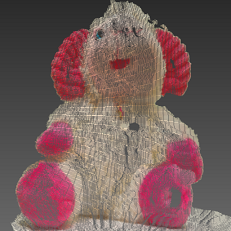

# 3D-Reconstructor
A 3D reconstrutor project. 

The project is devoted to a problem of recreating real world scenes in 3D models basing on image data alone or supported by Android sensors (Actually I hope to build a cloud-based something, which will allow to use different clients to obtain inital data, and not stick to Android). 3D reconstruction includes many steps and the calculation of the 3D points is not the most complicated one. To get to depth computation one should perform such procedures as camera calibration (both internal and external), finding initial correspondences to compute a fundamental matrix, building the epipolar relationship etc. Only after that a model can be constructed. This project includes all these steps.  

Currently the project is in a preparatory phase, and getting ready for further iterations. However, it is able to build a model for a two-view setup:  

##Features 

###Core

- Reconstrution accoring to Passive Stereo approach up to metric similarity; 
- Camera calibration by FOV;
- Initial points search: manual, K-means clusterization, image convolution (based of SURF); 
- Building a fundamental matrix and epipolar equations; 
- External calibration parameters: manual setup, extracting from the fundamental matrix;
- Matching correspondences using fundamental matrix;
- Building a VRML pointset.

###Side
- Separate branch for OpenCV experiments; 

##TODO list for the 0.1 version
- Finish cleaning the project; 
- Encapsulate core reconstruction functionality; 
- Write valid maven script.

###Author
Egor Lapidus, M.S. Software Engineering. ctapblixpbl4@gmail.com
